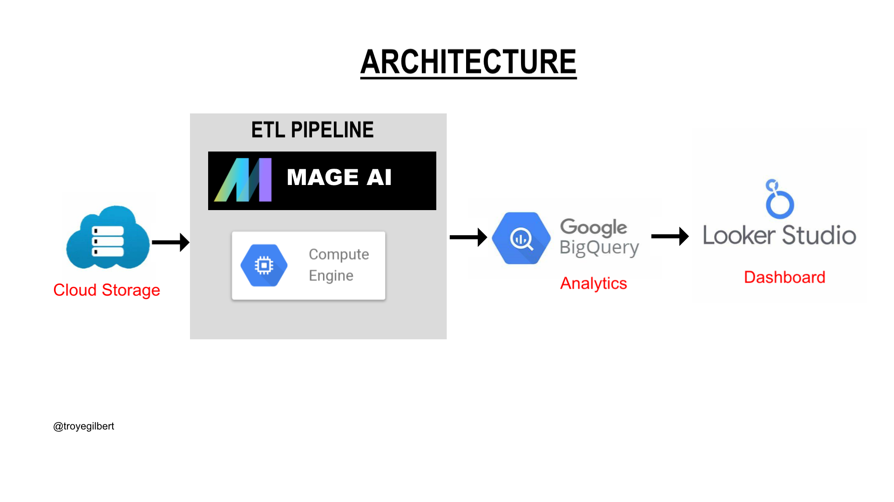
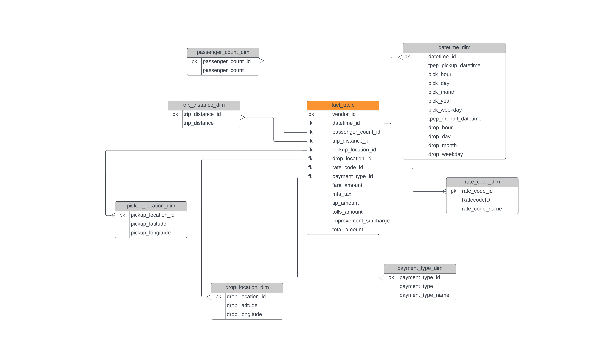
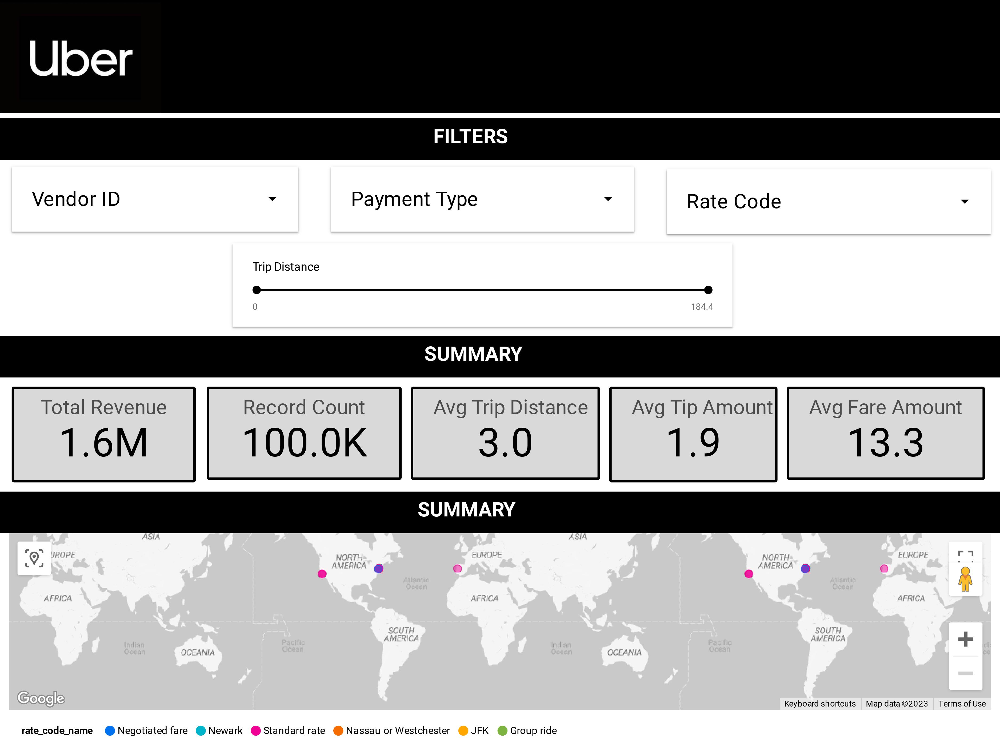

# Uber-Data-Analytics-ETL

## Introduction
A data analytics on Uber data using various tools and technologies, including GCP Storage, Python, Compute Instance, Mage Data Pipeline Tool, BigQuery, and Looker Studio.

## Architecture 

## Data Model

## Dashboard

## Technology Used
- Programming Language - Python

1. Google Storage
2. Compute Instance 
3. BigQuery
4. Looker Studio
